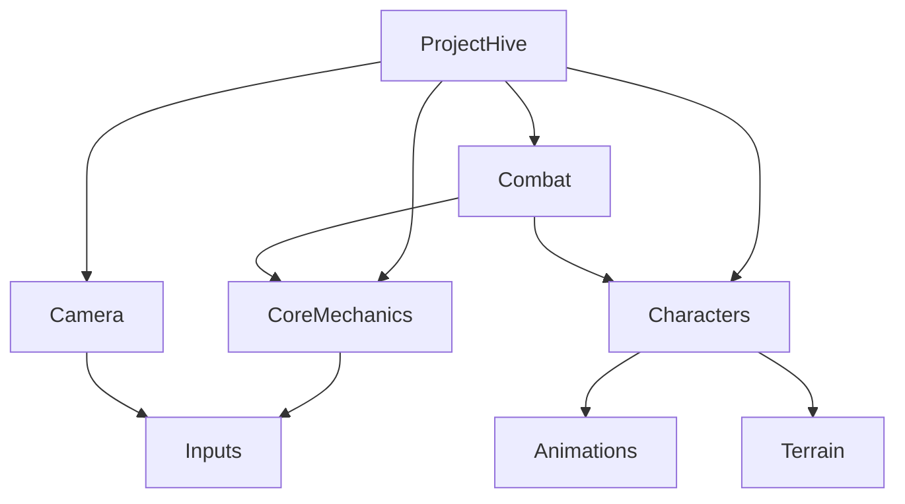

# ProjectHive 5.5 - System Architecture Documentation

## 🏗️ **Architecture Overview**
**Last Updated:** August 23, 2025  
**Architecture Version:** 2.0 (Post-Refactoring)  
**Target Engine:** Unreal Engine 5.5

---

## 📐 **System Design Principles**

### **1. Single Source of Truth**
- **GameStateManager** serves as the central authority for all game states
- All other systems reference GameStateManager for state information
- Prevents state desynchronization and conflicts

### **2. Modular Component Architecture**
- Each module has a specific responsibility domain
- Clear interfaces between modules
- Easy to test, modify, and extend individual components

### **3. Event-Driven Communication**
- Systems communicate via UE5 delegate system
- Loose coupling between components
- Clear subscription/notification patterns

### **4. Enhanced Input Integration**
- Modern UE5 Enhanced Input System throughout
- Context-sensitive input mapping
- Configurable and remappable controls

---

## 🏛️ **Module Structure**

### **Core Modules Hierarchy**
```
ProjectHive 5.5
├── ProjectHive (Main)           # Core gameplay logic
├── CoreMechanics               # Game state, squad management
├── Combat                      # ATB system, ability management
├── Camera                      # Tactical camera control
├── Characters                  # Units, AI, combat
├── Terrain                     # Cover system, environment
├── Animations                  # Character animation systems
├── Inputs                      # Enhanced Input integration
└── CoreUi                      # User interface systems
```

### **Module Dependencies**


---

## 🎮 **Core System Architecture**

### **1. GameStateManager (Central Authority)**
**Location:** `Source/CoreMechanics/Public/GameStateManager.h`

**Responsibilities:**
- Game flow state management (MainMenu, InGame, Paused, GameOver)
- Tactical state control (RealTime, TacticalPause, SlowMotion, CommandPlanning)
- Global time scale management
- Settings persistence and access
- Event broadcasting for state changes

**Design Pattern:** Singleton
```cpp
// Global access pattern
UGameStateManager* GameState = UGameStateManager::GetInstance(this);
ETacticalState CurrentState = GameState->GetTacticalState();
```

**Key Events:**
- `OnGameStateChanged` - Notifies of major game state transitions
- `OnTacticalStateChanged` - Notifies of tactical pause/slowmo changes
- `OnTimeScaleChanged` - Notifies when world time scale changes
- `OnATBStateChanged` - Notifies when ATB tactical mode is suggested
- `OnAbilityReady` - Broadcasts when unit ATB gauges reach full

### **2. Squad Management System**

#### **SquadManager (Command Processing)**
**Location:** `Source/CoreMechanics/Public/SquadManager.h`

**Responsibilities:**
- Squad member management and formation control
- Command execution (Move, Attack, TakeCover, HoldPosition)
- Command queuing for tactical pause scenarios
- Smart AI behaviors (cover detection, suppressive fire)
- Formation maintenance (Tight, Spread, Wedge)

**Key Interfaces:**
```cpp
// Main command interface
void ProcessContextualCommand(const FVector& WorldLocation, AActor* TargetActor);
void QueueCommand(ESquadCommandType CommandType, const FVector& TargetLocation);
void SetFormation(ESquadFormationType NewFormation);
```

#### **SquadPlayerController (Input Handling)**
**Location:** `Source/CoreMechanics/Public/SquadPlayerController.h`

**Responsibilities:**
- Enhanced Input System integration
- Input event processing and contextual command determination
- Manager coordination and initialization
- Camera control delegation
- Cursor feedback and UI interaction

**Input Processing Flow:**
1. Enhanced Input Action triggered
2. World position/actor determination
3. Context analysis (ground, enemy, cover)
4. Command type determination
5. SquadManager command execution

### **3. Camera System**

#### **TacticalCameraController**
**Location:** `Source/Camera/Public/TacticalCameraController.h`

**Responsibilities:**
- Top-down tactical view management
- Smooth WASD movement with configurable speed
- Mouse wheel zoom with bounds checking
- Middle-mouse rotation and additional zoom
- Edge scrolling support
- Camera bounds enforcement

**Movement System:**
```cpp
// Smooth movement implementation
FVector MovementInput = FVector(ForwardInput, RightInput, 0.0f);
FVector NewLocation = GetActorLocation() + (MovementInput * MovementSpeed * DeltaTime);
SetActorLocation(NewLocation);
```

### **4. Combat System (ATB)**

#### **ATB Manager (Hybrid Special Abilities)**
**Location:** `Source/Combat/Public/ATBManager.h`  
**Documentation:** `COMBAT_MECHANICS_ARCHITECTURE.md`

**Responsibilities:**
- Active Time Battle gauge management for special abilities
- Real-time combat flow preservation (basic actions always available)
- Tactical opportunity detection and suggestion
- Special ability execution and coordination
- Combat state tracking and ATB fill rate management

**Design Philosophy:**
- **Hybrid System**: Basic combat flows freely, special abilities gated by ATB
- **Natural Pacing**: ATB creates organic tactical decision points
- **Squad Coordination**: Multiple ATB gauges enable complex combinations
- **Strategic Resource Management**: Players must time ability usage optimally

**Key ATB Features:**
```cpp
// ATB system core functionality
class UATBManager
{
    // Tactical opportunity detection
    bool ShouldSuggestTacticalMode() const;
    
    // Multi-unit ATB coordination
    TArray<ASelectableUnit*> GetUnitsWithReadyATB() const;
    
    // Activity-based progression
    void UpdateATBFillRates(float CombatActivity, bool bInTacticalMode);
};
```

---

## 🔧 **Enhanced Input System Architecture**

### **Input Action Hierarchy**
```
Enhanced Input Actions
├── Tactical Controls
│   ├── IA_TacticalPause (Space)
│   ├── IA_SlowMotion (Shift)
│   └── IA_FormationCycle (F)
├── Squad Commands
│   ├── IA_RightClick (Context Command)
│   ├── IA_LeftClick (Selection)
│   ├── IA_HoldPosition (H)
│   └── IA_TakeCover (C)
└── Camera Controls
    ├── IA_MoveForward (W/S)
    ├── IA_MoveRight (A/D)
    ├── IA_Zoom (Mouse Wheel)
    └── IA_CameraRotate (Q/E)
```

### **Input Mapping Context: IMC_SquadControl**
Central input context that defines all tactical control mappings:
- **Context Priority:** 0 (highest)
- **Mapping Behavior:** Override existing mappings
- **Platform Support:** PC (mouse/keyboard)

### **Input Processing Pipeline**
1. **Enhanced Input Action** triggered by hardware input
2. **SquadPlayerController** receives action callback
3. **Context Analysis** determines appropriate response
4. **Command Generation** creates specific squad command
5. **Manager Delegation** routes to appropriate system
6. **Execution** occurs immediately or queued based on game state

---

## 🎯 **Formation System Design**

### **Formation Types & Algorithms**
```cpp
enum class ESquadFormationType : uint8
{
    Tight,      // Close circular formation - 100 unit radius
    Spread,     // Wide circular formation - 200 unit radius  
    Wedge       // V-shaped tactical formation
};
```

### **Formation Calculation Algorithm**
```cpp
FVector CalculateFormationOffset(int32 MemberIndex, ESquadFormationType Formation)
{
    switch (Formation)
    {
        case ESquadFormationType::Tight:
            return FVector(
                FMath::Cos(Angle) * TightRadius,
                FMath::Sin(Angle) * TightRadius,
                0.0f
            );
        case ESquadFormationType::Wedge:
            // V-shaped positioning based on member index
            return CalculateWedgePosition(MemberIndex);
    }
}
```

### **Formation Maintenance**
- **Update Frequency:** Every 0.1 seconds
- **Tolerance:** 50 units from ideal position
- **Behavior:** Gradual movement toward ideal position
- **Obstacles:** Automatic pathfinding around obstacles

---

## ⚡ **Performance Architecture**

### **Update Frequency Optimization**
| System | Update Rate | Reason |
|--------|------------|--------|
| GameStateManager | 60 FPS | Critical state management |
| SquadManager | 30 FPS | Formation and command processing |
| Formation Updates | 10 FPS | Smooth movement, not critical |
| Cover Detection | 5 FPS | Expensive spatial queries |

### **Memory Management**
- **Object Pooling:** Used for temporary command objects
- **Smart Pointers:** TSharedPtr for manager references
- **Garbage Collection:** Standard UE5 UObject lifecycle
- **Static Arrays:** Fixed-size squad member arrays (max 6)

### **Spatial Optimization**
- **Spatial Hashing:** For cover point detection
- **LOD System:** Character detail based on camera distance
- **Culling:** Off-screen character updates reduced

---

## 🔄 **State Management Flow**

### **Game State Transitions**
```
MainMenu → Loading → InGame ⇄ Paused → GameOver
                        ↓
            TacticalPause ⇄ SlowMotion ⇄ RealTime
```

### **Tactical State Behavior**
```cpp
void UGameStateManager::SetTacticalState(ETacticalState NewState)
{
    // Validate transition
    if (!IsValidTransition(CurrentTacticalState, NewState)) return;
    
    // Update time scale
    UpdateTimeScale(NewState);
    
    // Notify all listeners
    OnTacticalStateChanged.Broadcast(NewState);
    
    // Update internal state
    CurrentTacticalState = NewState;
}
```

---

## 🧩 **Component Relationships**

### **Manager Communication Pattern**
```cpp
// Managers access GameState for settings
const FGameSettings& Settings = GameState->GetGameSettings();

// Managers respond to state changes via delegates
GameState->OnTacticalStateChanged.AddDynamic(this, &USquadManager::OnStateChanged);

// Managers maintain their specific responsibilities
SquadManager->ProcessContextualCommand(Location, Target);
```

### **Dependency Injection Pattern**
```cpp
// Controllers initialize and coordinate managers
void ASquadPlayerController::BeginPlay()
{
    Super::BeginPlay();
    
    // Initialize GameState singleton
    GameStateManager = UGameStateManager::GetInstance(this);
    
    // Initialize SquadManager with GameState reference
    SquadManager = CreateDefaultSubobject<USquadManager>(TEXT("SquadManager"));
    SquadManager->Initialize(this, GameStateManager);
}
```

---

## 🔮 **Future Architecture Considerations**

### **Completed System Additions**
1. **ATB Combat System** ✅
   - Integrated with existing GameStateManager time control
   - New Combat module with ATBManager component
   - Event-driven special ability execution
   - Hybrid design preserves real-time flow while adding strategic depth

### **Planned System Additions**
2. **Faction System**
   - New module: Factions
   - Integration with mission and squad systems
   - Persistent relationship tracking

3. **Mission Framework**
   - New component: MissionManager
   - Procedural objective generation
   - Integration with extraction mechanics

### **Scalability Preparations**
- **Component-based architecture** ready for new systems
- **Interface abstractions** allow system swapping
- **Event-driven design** supports complex system interactions
- **Modular structure** allows parallel development

### **Multiplayer Considerations**
- **State management** designed for potential replication
- **Command queuing** compatible with client-server model
- **Event system** can be extended for network notifications

---

## 📋 **Architecture Decisions Log**

### **Major Decisions Made**
1. **Singleton GameStateManager** - Chosen for global state access simplicity
2. **Enhanced Input System** - Modern UE5 approach over legacy input
3. **Event-driven communication** - Loose coupling and extensibility
4. **Squad-only control** - Simplified from individual unit management
5. **Formation-based movement** - Better than individual pathfinding

### **Alternative Approaches Considered**
1. **GameState as UObject vs Actor** - UObject chosen for persistence
2. **Direct manager communication vs events** - Events chosen for loose coupling
3. **Blueprint-only vs C++ core** - C++ chosen for performance and maintainability
4. **Individual unit AI vs squad AI** - Squad AI chosen for unified behavior

### **Technical Trade-offs**
- **Singleton vs Dependency Injection** - Singleton chosen for simplicity, aware of testability trade-off
- **Performance vs Flexibility** - Moderate optimization level, prioritizing maintainability
- **Immediate mode vs Command pattern** - Command pattern for tactical pause support

---

## 🛠️ **Development Guidelines**

### **Adding New Systems**
1. **Create interface** in appropriate module
2. **Implement core functionality** with proper error handling
3. **Add GameStateManager integration** if state-dependent
4. **Create delegate events** for system notifications
5. **Add Blueprint exposure** for designer accessibility
6. **Update documentation** including this architecture guide

### **Modifying Existing Systems**
1. **Check dependencies** before making changes
2. **Maintain interface compatibility** or update all consumers
3. **Test state transitions** if modifying GameStateManager
4. **Update delegates** if changing event signatures
5. **Verify Blueprint integration** still functions

### **Code Quality Standards**
- **Header documentation** required for all public interfaces
- **Error handling** for all external inputs
- **Performance considerations** for Tick methods
- **Blueprint compatibility** for designer-facing systems
- **Unit tests** for critical logic components

This architecture provides a solid foundation for the tactical extraction shooter gameplay while maintaining clean separation of concerns and extensibility for future features.
