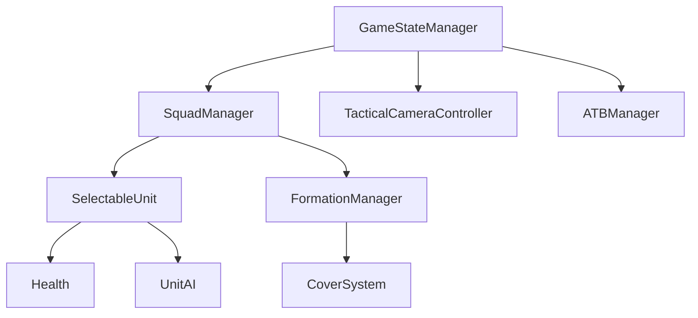

# ProjectZero - Unity System Architecture Documentation

## 🏗️ **Architecture Overview**
**Last Updated:** August 28, 2025  
**Architecture Version:** 3.0 (Unity Port)  
**Target Engine:** Unity 2022.3 LTS  
**Previous Version:** ProjectHive 5.5 (Unreal Engine 5.5)

---

## 📐 **Unity System Design Principles**

### **1. Single Source of Truth**
- **GameStateManager** serves as the central authority for all game states
- All other systems reference GameStateManager for state information
- Prevents state desynchronization and conflicts
- Implemented as Unity Singleton MonoBehaviour

### **2. Component-Based Architecture**
- Each system is a Unity MonoBehaviour component with specific responsibility
- Clear interfaces between components using Unity Events
- Easy to test, modify, and extend individual components
- Leverages Unity's built-in component system

### **3. Event-Driven Communication**
- Systems communicate via Unity Events and C# Actions
- Loose coupling between components
- Clear subscription/notification patterns
- Inspector-configurable event connections

### **4. Unity Input System Integration**
- Modern Unity Input System throughout
- Context-sensitive input action maps
- Configurable and remappable controls via Input Actions assets

---

## 🏛️ **Unity Folder Structure**

### **Project Organization**
```
Assets/_Project/
├── Scripts/
│   ├── Core/                   # GameStateManager, singletons
│   ├── Squad/                  # SquadManager, formation system
│   ├── Combat/                 # ATB system, weapons, health
│   ├── Camera/                 # Tactical camera with Cinemachine
│   ├── Characters/             # SelectableUnit, AI behaviors
│   ├── Cover/                  # Cover point system
│   ├── Input/                  # Input handling components
│   ├── UI/                     # HUD, tactical interface
│   └── Utilities/              # Helper classes, extensions
├── Prefabs/
│   ├── Characters/             # Unit prefabs with components
│   ├── Squad/                  # Squad controller prefabs
│   ├── Cover/                  # Cover point prefabs
│   ├── UI/                     # Interface prefabs
│   └── Managers/               # System manager prefabs
├── Scenes/
├── Materials/
├── Input/                      # Input Actions assets
└── Art/
    ├── Characters/
    ├── Environment/
    └── Effects/
```

### **Script Dependencies**


---

## 🎮 **Core Unity System Architecture**

### **1. GameStateManager (Singleton MonoBehaviour)**
**Location:** `Assets/_Project/Scripts/Core/GameStateManager.cs`

**Responsibilities:**
- Game flow state management (MainMenu, InGame, Paused, GameOver)
- Tactical state control (RealTime, TacticalPause, SlowMotion, CommandPlanning)
- Global time scale management using Time.timeScale
- Settings persistence using Unity PlayerPrefs
- Event broadcasting using Unity Events

**Unity Implementation:**
```csharp
public class GameStateManager : MonoBehaviour
{
    private static GameStateManager _instance;
    public static GameStateManager Instance => _instance;
    
    [Header("States")]
    public GameState currentGameState = GameState.MainMenu;
    public TacticalState currentTacticalState = TacticalState.RealTime;
    
    [Header("Unity Events")]
    public UnityEvent<GameState> OnGameStateChanged;
    public UnityEvent<TacticalState> OnTacticalStateChanged;
    public UnityEvent<float> OnTimeScaleChanged;
    
    private void Awake()
    {
        // Singleton implementation with DontDestroyOnLoad
        if (_instance == null)
        {
            _instance = this;
            DontDestroyOnLoad(gameObject);
        }
        else
        {
            Destroy(gameObject);
        }
    }
    
    public void SetTacticalState(TacticalState newState)
    {
        currentTacticalState = newState;
        UpdateTimeScale(newState);
        OnTacticalStateChanged?.Invoke(newState);
    }
}
```

### **2. Squad Management System (Unity Components)**

#### **SquadManager MonoBehaviour**
**Location:** `Assets/_Project/Scripts/Squad/SquadManager.cs`

**Responsibilities:**
- Squad member management using Unity Transform hierarchy
- Command execution (Move, Attack, TakeCover, HoldPosition)
- Command queuing for tactical pause scenarios
- Formation control using Unity positioning system
- NavMesh integration for pathfinding

**Unity Implementation:**
```csharp
public class SquadManager : MonoBehaviour
{
    [Header("Squad Configuration")]
    [SerializeField] private List<SelectableUnit> squadMembers;
    [SerializeField] private FormationType currentFormation = FormationType.Tight;
    
    [Header("Formation Settings")]
    public float tightRadius = 2f;
    public float spreadRadius = 4f;
    public float wedgeSpacing = 3f;
    
    private Queue<SquadCommand> commandQueue = new Queue<SquadCommand>();
    
    public void ProcessContextualCommand(Vector3 worldPosition, GameObject targetObject = null)
    {
        SquadCommand command = DetermineCommand(worldPosition, targetObject);
        
        if (GameStateManager.Instance.currentTacticalState == TacticalState.Paused)
        {
            QueueCommand(command);
        }
        else
        {
            ExecuteCommand(command);
        }
    }
    
    private void ExecuteCommand(SquadCommand command)
    {
        foreach (var unit in squadMembers)
        {
            Vector3 formationOffset = CalculateFormationOffset(squadMembers.IndexOf(unit));
            unit.MoveTo(command.targetPosition + formationOffset);
        }
    }
}
```

#### **SquadPlayerController (Input Handler)**
**Location:** `Assets/_Project/Scripts/Input/SquadPlayerController.cs`

**Responsibilities:**
- Unity Input System integration using Input Actions
- Input event processing and contextual command determination
- Manager coordination and initialization
- Camera control delegation via Cinemachine
- Cursor feedback using Unity UI system

**Unity Input Processing Flow:**
1. Unity Input Action triggered
2. World position determination using Camera.ScreenToWorldPoint
3. Raycast for target object detection
4. Context analysis (ground, enemy, cover) using Unity layers
5. SquadManager command execution

### **3. Camera System (Cinemachine Integration)**

#### **TacticalCameraController MonoBehaviour**
**Location:** `Assets/_Project/Scripts/Camera/TacticalCameraController.cs`

**Responsibilities:**
- Top-down tactical view using Cinemachine Virtual Camera
- WASD movement with smooth interpolation
- Mouse wheel zoom using Cinemachine FOV or camera distance
- Camera bounds enforcement using Unity's built-in math
- Edge scrolling support with mouse position detection

**Unity Camera Implementation:**
```csharp
public class TacticalCameraController : MonoBehaviour
{
    [Header("Cinemachine")]
    public CinemachineVirtualCamera virtualCamera;
    public Transform cameraTarget;
    
    [Header("Movement")]
    public float moveSpeed = 10f;
    public Vector2 mapBounds = new Vector2(50f, 50f);
    
    private SquadControls inputControls;
    private CinemachineFramingTransposer framingTransposer;
    
    private void Update()
    {
        HandleCameraMovement();
        HandleCameraZoom();
        EnforceBounds();
    }
    
    private void HandleCameraMovement()
    {
        Vector2 input = inputControls.CameraControls.Movement.ReadValue<Vector2>();
        Vector3 movement = new Vector3(input.x, 0, input.y) * moveSpeed * Time.unscaledDeltaTime;
        cameraTarget.position += movement;
    }
}
```

### **4. Character System (Unity NavMesh Integration)**

#### **SelectableUnit MonoBehaviour**
**Location:** `Assets/_Project/Scripts/Characters/SelectableUnit.cs`

**Responsibilities:**
- Unity NavMesh Agent integration for movement
- Health and damage system using Unity components
- Role-based behavior system
- Selection highlighting using Unity materials/shaders

**Unity Character Implementation:**
```csharp
[RequireComponent(typeof(NavMeshAgent))]
public class SelectableUnit : MonoBehaviour
{
    [Header("Unit Configuration")]
    public string unitName;
    public UnitRole role;
    
    [Header("Movement")]  
    public float moveSpeed = 3.5f;
    
    private NavMeshAgent navAgent;
    private Health health;
    private Renderer unitRenderer;
    
    private void Awake()
    {
        navAgent = GetComponent<NavMeshAgent>();
        health = GetComponent<Health>();
        unitRenderer = GetComponent<Renderer>();
        
        navAgent.speed = moveSpeed;
    }
    
    public void MoveTo(Vector3 destination)
    {
        if (navAgent != null && navAgent.isActiveAndEnabled)
        {
            navAgent.SetDestination(destination);
        }
    }
    
    public void SetSelected(bool selected)
    {
        // Use Unity materials for selection feedback
        if (selected)
        {
            unitRenderer.material.SetColor("_EmissionColor", Color.yellow);
        }
        else
        {
            unitRenderer.material.SetColor("_EmissionColor", Color.black);
        }
    }
}
```

---

## ⚡ **Unity Performance Architecture**

### **Update Frequency Optimization**
| System | Update Method | Frequency | Unity Approach |
|--------|---------------|-----------|----------------|
| GameStateManager | Update() | Every Frame | Time.unscaledDeltaTime for pause-independent updates |
| SquadManager | FixedUpdate() | 50Hz | Physics-independent formation updates |
| Formation Updates | Coroutine | 10Hz | UpdateFormation() coroutine with WaitForSeconds |
| Cover Detection | Coroutine | 5Hz | Physics.OverlapSphere with layer masks |

### **Unity-Specific Optimizations**
- **Object Pooling:** Use Unity's built-in object pooling for projectiles
- **Component Caching:** Cache GetComponent calls in Awake()
- **Layer Masks:** Use layers for efficient collision detection
- **Coroutines:** Replace Update loops with coroutines where appropriate
- **Job System:** Use Unity Jobs for expensive pathfinding calculations

### **Memory Management**
- **ScriptableObjects:** For configuration data and faction settings
- **Prefab Variants:** For character customization without duplication
- **Texture Streaming:** For character textures and environment art
- **Audio Loading:** Stream large audio files, keep SFX in memory

---

## 🔄 **Unity State Management Flow**

### **Game State Transitions**
```
MainMenu → Loading → InGame ⇄ Paused → GameOver
                       ↓
           TacticalPause ⇄ SlowMotion ⇄ RealTime
```

### **Unity Time Control Implementation**
```csharp
public void SetTacticalState(TacticalState newState)
{
    currentTacticalState = newState;
    
    // Unity-specific time control
    float targetTimeScale = newState switch
    {
        TacticalState.Paused => 0f,
        TacticalState.SlowMotion => 0.3f,
        TacticalState.CommandPlanning => 0.1f,
        _ => 1f
    };
    
    Time.timeScale = targetTimeScale;
    OnTacticalStateChanged?.Invoke(newState);
}
```

---

## 🧩 **Unity Component Relationships**

### **Manager Communication Pattern**
```csharp
// Unity Event-based communication
public class SquadManager : MonoBehaviour
{
    private void Start()
    {
        // Subscribe to GameStateManager events
        GameStateManager.Instance.OnTacticalStateChanged.AddListener(OnTacticalStateChanged);
    }
    
    private void OnTacticalStateChanged(TacticalState newState)
    {
        // Handle state change specific to squad management
        if (newState == TacticalState.Paused)
        {
            ProcessQueuedCommands();
        }
    }
}
```

### **Unity Scene Hierarchy Pattern**
```
MainGame Scene
├── GameStateManager (DontDestroyOnLoad)
├── SquadController
│   ├── SquadManager
│   └── Formation Indicator (UI)
├── CameraSystem  
│   ├── Camera Target (Transform)
│   └── CM Virtual Camera
├── Squad Members
│   ├── Unit_01 (SelectableUnit + NavMeshAgent)
│   ├── Unit_02 (SelectableUnit + NavMeshAgent)  
│   └── Unit_03 (SelectableUnit + NavMeshAgent)
└── Environment
    ├── Terrain (Navigation Static)
    ├── Cover Points (CoverPoint components)
    └── Obstacles (Navigation Static)
```

---

## 🔮 **Unity-Specific Future Architecture**

### **Phase 1: Foundation (Unity Implementation)**
- **GameStateManager** - Unity Singleton with Events
- **SquadManager** - Component-based squad control
- **TacticalCameraController** - Cinemachine integration
- **SelectableUnit** - NavMesh Agent integration
- **Unity Input System** - Modern input handling

### **Phase 2: Combat System (Unity Components)**
- **ATBManager** - Coroutine-based action timing
- **Health** - Unity component with UI integration  
- **WeaponSystem** - Unity physics and projectiles
- **UnitAI** - Behavior trees using Unity's AI packages

### **Phase 3: Advanced Systems (Unity Features)**
- **FactionManager** - ScriptableObject-based faction system
- **MissionManager** - Unity Scene management for procedural missions
- **CoverSystem** - GameObject-based cover points with triggers
- **UIManager** - Unity UI system for tactical interface

### **Unity-Specific Advantages**
- **Cross-Platform Deployment** - Easy builds for PC, console, mobile
- **Visual Scripting** - Unity Bolt for designer-friendly logic
- **Asset Store Integration** - Access to pre-built systems and assets
- **Profiler Tools** - Built-in performance analysis
- **Version Control** - Unity Smart Merge for team development

---

## 📋 **Unity Implementation Guidelines**

### **Adding New Unity Systems**
1. **Create MonoBehaviour script** in appropriate folder
2. **Define public interface** with [SerializeField] fields
3. **Add GameStateManager integration** using Unity Events
4. **Create component events** using UnityAction delegates
5. **Create prefab** for reusable system setup
6. **Update scene configuration** and manager references

### **Unity Coding Standards**
- **Component Caching:** Cache all GetComponent calls in Awake()
- **Inspector Exposure:** Use [SerializeField] for designer-accessible fields
- **Event Handling:** Use Unity Events for cross-component communication
- **Performance:** Use object pooling and coroutines appropriately
- **Debugging:** Add Debug.Log statements with conditional compilation

### **Unity Best Practices**
```csharp
public class ExampleUnityComponent : MonoBehaviour
{
    [Header("Configuration")]
    [SerializeField] private float exampleValue = 1f;
    
    [Header("Events")]
    public UnityEvent<float> OnValueChanged;
    
    // Cache components in Awake
    private NavMeshAgent cachedNavAgent;
    
    private void Awake()
    {
        cachedNavAgent = GetComponent<NavMeshAgent>();
    }
    
    private void Start()
    {
        // Subscribe to events in Start (after all Awake calls)
        GameStateManager.Instance.OnTacticalStateChanged.AddListener(HandleTacticalState);
    }
    
    private void OnDestroy()
    {
        // Always unsubscribe to prevent memory leaks
        if (GameStateManager.Instance != null)
        {
            GameStateManager.Instance.OnTacticalStateChanged.RemoveListener(HandleTacticalState);
        }
    }
}
```

---

## 🔧 **Unity Technical Implementation Details**

### **NavMesh Integration**
```csharp
// Squad movement using Unity NavMesh
public void MoveSquadToPosition(Vector3 targetPosition)
{
    for (int i = 0; i < squadMembers.Count; i++)
    {
        Vector3 formationOffset = CalculateFormationOffset(i);
        Vector3 memberDestination = targetPosition + formationOffset;
        
        // Use Unity NavMesh for pathfinding
        if (NavMesh.SamplePosition(memberDestination, out NavMeshHit hit, 2f, NavMesh.AllAreas))
        {
            squadMembers[i].GetComponent<NavMeshAgent>().SetDestination(hit.position);
        }
    }
}
```

### **Unity Event System Usage**
```csharp
// Event-driven architecture using Unity Events
[Header("Squad Events")]
public UnityEvent<Vector3> OnSquadMovementCommand;
public UnityEvent<FormationType> OnFormationChanged;
public UnityEvent<SelectableUnit> OnUnitSelected;

// Event invocation
OnSquadMovementCommand?.Invoke(targetPosition);

// Event subscription (in other components)
squadManager.OnSquadMovementCommand.AddListener(HandleSquadMovement);
```

### **Coroutine-Based Systems**
```csharp
// ATB system using Unity Coroutines
public class ATBManager : MonoBehaviour
{
    private void Start()
    {
        StartCoroutine(ATBUpdateLoop());
    }
    
    private IEnumerator ATBUpdateLoop()
    {
        while (true)
        {
            // Update ATB gauges for all units
            foreach (var unit in allUnits)
            {
                unit.UpdateATBGauge(Time.deltaTime);
            }
            
            // Check for tactical opportunities
            if (ShouldSuggestTacticalMode())
            {
                GameStateManager.Instance.OnATBTacticalSuggestion?.Invoke();
            }
            
            yield return new WaitForSeconds(0.1f); // 10Hz update
        }
    }
}
```

---

## 🎯 **Unity Migration Benefits**

### **Technical Advantages**
- **Faster Iteration** - Unity's real-time compilation and play mode
- **Better Debugging** - Unity Profiler and Frame Debugger
- **Asset Pipeline** - More streamlined asset importing
- **Platform Support** - Easier deployment to multiple platforms
- **Package Manager** - Access to Unity packages and Asset Store

### **Development Workflow Improvements**
- **Visual Scripting** - Unity Bolt for rapid prototyping
- **Prefab System** - Better component reuse and variation management
- **Scene Management** - Additive scene loading for modular design
- **Testing Framework** - Unity Test Framework for automated testing

### **Team Collaboration**
- **Unity Smart Merge** - Better version control for Unity assets
- **Package Management** - Easier dependency management
- **Cross-Platform** - Single codebase for multiple platforms
- **Documentation** - Unity's extensive documentation and community

---

This architecture provides a robust foundation for the tactical extraction shooter in Unity while maintaining the core design principles from the original Unreal Engine version.
