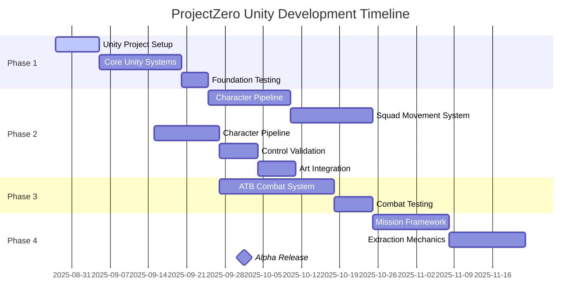

# ProjectZero - Development Roadmap (Unity Port)

## 🗺️ **Project Timeline & Milestones**
**Unity Port Started:** August 28, 2025  
**Original Project Started:** August 3, 2025 (Unreal Engine 5.5)  
**Current Phase:** Phase 1 - Foundation Systems (Unity Implementation)  
**Target Alpha:** November 15, 2025  
**Target Beta:** January 15, 2026

---

## 🚀 **Development Phases Overview**



---

## 🚀 **Phase 1: Unity Foundation Systems** (August 28 - September 25, 2025)

### **🎯 Phase Goals** ❌ **UNITY IMPLEMENTATION NEEDED**
- [ ] Set up Unity project with proper architecture
- [ ] Implement core systems in Unity C#
- [ ] Establish basic gameplay loop in Unity
- [ ] Create first Unity playable prototype

### **📋 Milestones to Implement**
- [ ] **Unity Project Setup** - Project creation and package installation
- [ ] **Script Architecture** - All Unity C# scripts organized in folders
- [ ] **GameStateManager** - Unity Singleton MonoBehaviour implementation
- [ ] **Camera System** - Cinemachine tactical camera integration
- [ ] **Squad Framework** - Unity component-based squad management
- [ ] **SquadPlayerController** - Unity Input System implementation
- [ ] **Unity Input System** - Input Actions and Action Maps created
- [ ] **Unity Prefabs** - SquadController, GameManager, SelectableUnit prefabs
- [ ] **Test Scene** - Unity scene with NavMesh and game manager setup
- [ ] **Cover System Foundation** - Unity GameObject-based cover points

### **🎯 Phase 1 Success Criteria** ❌ **UNITY IMPLEMENTATION REQUIRED**
- [ ] Player can move camera with WASD smoothly using Cinemachine
- [ ] Right-click moves squad in formation using Unity NavMesh
- [ ] Space bar pauses game using Time.timeScale and allows command queuing
- [ ] F key cycles between Tight, Spread, and Wedge formations
- [ ] Basic tactical pause and slow motion functional with Unity time control
- [ ] No critical bugs in core Unity systems

---

## 🚧 **Phase 1.5: Squad Movement & Cover Integration** (August 26 - September 15, 2025)

### **🎯 Phase Goals**
- Implement Unit Cover AI Behavior
- Complete Squad Movement & Interaction System
- Integrate cover system with squad controls
- Create functional tactical gameplay loop

### **📋 Current Sprint (Aug 26 - Sep 6)**
| Task | Priority | Status | Completion Target |
|------|----------|--------|-----------------|
| **Unit Cover AI Implementation** | Critical | Not Started | Sep 1 |
| **Squad Cover Management System** | Critical | Not Started | Sep 3 |
| **Contextual Cursor & Interaction System** | High | Not Started | Sep 5 |
| **Combat Protection Integration** | High | Not Started | Sep 6 |

### **📋 Next Sprint (Sep 6 - Sep 15)**
| Task | Priority | Status | Completion Target |
|------|----------|--------|-----------------|
| **Cover Command UI Integration** | Medium | Not Started | Sep 10 |
| **System Testing & Polish** | High | Not Started | Sep 12 |
| **Performance Optimization** | Medium | Not Started | Sep 15 |

### **🎯 Phase 1.5 Success Criteria**
- [ ] Units automatically seek cover when taking damage
- [ ] V key triggers squad-wide "take cover" behavior
- [ ] Right-click on cover positions moves squad to cover
- [ ] Units in cover receive damage reduction bonuses
- [ ] Contextual cursor shows different states for cover/enemies/ground
- [ ] Squad formation system integrates with cover positioning
- [ ] Cover system performs well with 4-6 units simultaneously

### **⚠️ Phase 1.5 Risks**
- **AI Complexity** - Unit cover evaluation algorithms may need optimization
- **Squad Coordination** - Multiple units seeking same cover simultaneously
- **Performance Impact** - Cover calculations for multiple units

---

## 🎨 **Phase 2: Character Pipeline & Control** (September 6 - October 11, 2025)

### **🎯 Phase Goals**
- Establish complete character creation workflow
- Test and select optimal control scheme
- Create first production-ready characters
- Validate art direction with actual assets

### **📋 Major Milestones**

#### **Milestone 2.1: Character Pipeline** (Sep 6 - Sep 20)
- [ ] **Blender Workflow Setup**
  - Configure Blender for 200-500 triangle modeling
  - Create character creation guidelines
  - Test export/import pipeline
- [ ] **Mixamo Integration**
  - Set up Mixamo account and workflow
  - Test animation importing
  - Create animation blueprint templates
- [ ] **First Test Character**
  - Create low-poly marine model in Blender
  - Import through full pipeline
  - Test in-game with all systems

#### **Milestone 2.2: Control Scheme Testing** (Sep 20 - Oct 4)
- [ ] **Prototype 1: Pure Squad Commands**
  - Implement unified squad movement only
  - Test with focus groups for usability
  - Measure learning curve and efficiency
- [ ] **Prototype 2: Individual Unit Control**
  - Add individual selection capability
  - Test precision vs complexity trade-off
  - Evaluate for hardcore vs casual appeal
- [ ] **Prototype 3: Context-Sensitive Hybrid**
  - Implement smart context switching
  - Test hotkey toggles between modes
  - Evaluate cognitive load
- [ ] **Prototype 4: Role-Based Commands**
  - Implement "Sniper, overwatch" style commands
  - Test AI interpretation accuracy
  - Evaluate natural language feel

#### **Milestone 2.3: System Integration** (Oct 4 - Oct 11)
- [ ] **Control Scheme Selection**
  - Analyze testing data from all prototypes
  - Select optimal approach for full development
  - Document decision rationale
- [ ] **Character Art Validation**
  - Test multiple character styles in-game
  - Validate readability at tactical distances
  - Confirm faction color coding works
- [ ] **Performance Optimization**
  - Profile character rendering performance
  - Optimize for target 60 FPS with 6 characters
  - Implement LOD system if needed

### **🎯 Phase 2 Success Criteria**
- [ ] Complete character pipeline from Blender to game
- [ ] At least 3 distinct character models working in-game
- [ ] Selected control scheme feels intuitive and responsive
- [ ] Characters readable at all tactical camera distances
- [ ] Performance maintains 60 FPS with full squad

### **⚠️ Phase 2 Risks**
- **Art style uncertainty** - May require multiple iterations
- **Control scheme deadlock** - All options may have significant trade-offs
- **Animation complexity** - Mixamo integration may have technical issues
- **Performance bottlenecks** - Character rendering may exceed budget

---

## ⚔️ **Phase 3: ATB Combat System** (October 11 - November 1, 2025)

### **🎯 Phase Goals**
- Implement Active Time Battle mechanics
- Create engaging combat flow
- Balance real-time action with tactical planning
- Establish core combat gameplay loop

### **📋 Major Milestones**

#### **Milestone 3.1: ATB Foundation** (Oct 11 - Oct 18)
- [ ] **ATB Manager System**
  - Create ATBManager class with tick system
  - Implement action bars for all units (player and AI)
  - Add time scale integration with GameStateManager
- [ ] **Action Queue System**
  - Extend command queuing for ATB timing
  - Add action timing and delays
  - Implement action interruption mechanics
- [ ] **Visual ATB Interface**
  - Create UI elements for action bars
  - Add visual feedback for action timing
  - Implement slow-motion visual effects

#### **Milestone 3.2: Combat Mechanics** (Oct 18 - Oct 25)
- [ ] **Weapon Systems**
  - Implement basic weapon types (rifle, sniper, etc.)
  - Add damage calculation and health systems
  - Create projectile and hit-scan systems
- [ ] **AI Combat Behavior**
  - Implement enemy ATB behavior trees
  - Add cover-seeking and flanking AI
  - Create threat assessment systems
- [ ] **Squad Coordination**
  - Add coordinated attack commands
  - Implement suppressive fire mechanics
  - Create formation-based combat tactics

#### **Milestone 3.3: Combat Testing & Balance** (Oct 25 - Nov 1)
- [ ] **Combat Flow Testing**
  - Create test scenarios with various enemy types
  - Test pacing and tension mechanics
  - Validate slow-motion decision-making feel
- [ ] **Balance Iteration**
  - Adjust ATB timing for optimal flow
  - Balance weapon damage and ranges
  - Tune enemy difficulty progression
- [ ] **Integration with Existing Systems**
  - Ensure combat works with all formations
  - Test tactical pause during combat
  - Verify state management during combat

### **🎯 Phase 3 Success Criteria**
- [ ] ATB system creates engaging combat rhythm
- [ ] Players can make meaningful tactical decisions during combat
- [ ] Slow-motion enhances rather than disrupts gameplay
- [ ] Combat feels balanced between action and strategy
- [ ] Squad coordination creates emergent tactical situations

### **⚠️ Phase 3 Risks**
- **ATB complexity** - May be too complex for target audience
- **Performance overhead** - Combat systems may impact framerate
- **Balance challenges** - Combat pacing may require extensive iteration
- **State management complexity** - Combat interactions with pause/slowmo

---

## 🎯 **Phase 4: Mission Framework** (November 1 - November 29, 2025)

### **🎯 Phase Goals**
- Create extraction-based mission structure
- Implement procedural objective system
- Add faction relationship mechanics
- Achieve Alpha release milestone

### **📋 Major Milestones**

#### **Milestone 4.1: Mission Foundation** (Nov 1 - Nov 8)
- [ ] **Mission Manager System**
  - Create procedural objective generation
  - Implement multiple extraction points
  - Add time pressure and escalation mechanics
- [ ] **Map System**
  - Create hybrid procedural/fixed landmark system
  - Implement faction territory boundaries
  - Add environmental hazards and obstacles

#### **Milestone 4.2: Faction System** (Nov 8 - Nov 15)
- [ ] **Faction Relationship Tracking**
  - Implement affinity system
  - Create consequence mechanics
  - Add territorial control systems
- [ ] **Political Consequences**
  - Actions affect faction standing
  - Territory access based on relationships
  - Faction conflict scenarios

#### **Milestone 4.3: Extraction Mechanics** (Nov 15 - Nov 22)
- [ ] **Risk/Reward Systems**
  - Longer missions provide better rewards
  - Time pressure increases danger
  - Permadeath consequences implementation
- [ ] **Mission Variety**
  - Multiple objective types
  - Dynamic threat escalation
  - Environmental challenges

#### **Milestone 4.4: Alpha Release Preparation** (Nov 22 - Nov 29)
- [ ] **Integration Testing**
  - All systems working together
  - Full gameplay loop functional
  - No critical bugs
- [ ] **Performance Optimization**
  - Stable 60 FPS target
  - Memory usage optimization
  - Load time optimization
- [ ] **Alpha Build Creation**
  - Packaging and distribution setup
  - Basic documentation for testers
  - Feedback collection systems

### **🎯 Phase 4 Success Criteria**
- [ ] Complete extraction mission playable from start to finish
- [ ] Faction system creates meaningful consequences
- [ ] Multiple mission types provide variety
- [ ] Alpha build stable and ready for external testing
- [ ] Core gameplay loop compelling and replayable

---

## 🔄 **Post-Alpha Roadmap** (December 2025+)

### **Beta Phase Goals**
- **Content Expansion**: More characters, weapons, mission types
- **Polish & Refinement**: UI/UX improvements, audio integration
- **Balancing**: Extensive playtesting and iteration
- **Platform Optimization**: Console and mobile considerations

### **Future Phases**
1. **Content Phase** - More factions, environments, story integration
2. **Multiplayer Phase** - Cooperative extraction missions
3. **Expansion Phase** - Base building, vehicle customization
4. **Release Phase** - Final polish, marketing, launch

---

## 📊 **Dependencies & Critical Path**

### **Critical Path Analysis**
```
Foundation → Character Pipeline → ATB Combat → Mission Framework → Alpha
     14d            21d             21d           28d         Total: 84d
```

### **Inter-Phase Dependencies**
- **Phase 2** depends on Phase 1 input system completion
- **Phase 3** depends on Phase 2 character and control system
- **Phase 4** depends on Phase 3 combat mechanics
- **Alpha** depends on all previous phases integration

### **Resource Allocation**
- **Programming**: 70% of effort (core systems, ATB, mission framework)
- **Art/Animation**: 20% of effort (characters, environments, effects)
- **Design/Testing**: 10% of effort (balance, playtesting, documentation)

---

## 🚨 **Risk Management**

### **High-Risk Items**
1. **Enhanced Input System Complexity** - May require dedicated Sprint
2. **ATB System Balance** - Complex gameplay mechanic requiring extensive testing
3. **Character Pipeline Performance** - May hit performance limits with multiple characters
4. **Faction System Scope** - Complex system that could expand beyond schedule

### **Mitigation Strategies**
- **Regular milestone reviews** every 2 weeks
- **Prototype early, fail fast** approach for complex systems
- **Performance testing** integrated into each phase
- **Scope reduction plan** for each major system if needed

### **Success Factors**
- **Clear architecture** provides solid foundation
- **Modular design** allows parallel development
- **Extensive documentation** enables efficient development
- **Regular testing** catches issues early

---

## 📅 **Review Schedule**

### **Weekly Reviews** (Every Friday)
- Progress against current sprint goals
- Blocker identification and resolution
- Resource allocation adjustments
- Risk assessment updates

### **Phase Reviews** (End of each phase)
- Complete phase goal assessment
- Architecture and design decisions review
- Performance and quality metrics evaluation
- Next phase planning and adjustment

### **Milestone Reviews** (Major deliverables)
- Stakeholder demonstration
- External feedback integration
- Strategic direction confirmation
- Timeline and scope adjustments

---

This roadmap provides a structured approach to developing ProjectZero in Unity while maintaining flexibility for adjustments based on testing results and emerging requirements. The focus on incremental milestones and regular reviews ensures steady progress toward a high-quality tactical extraction shooter experience.

**Unity Migration Note:** This roadmap adapts the original ProjectHive 5.5 design for Unity development, taking advantage of Unity's cross-platform capabilities and streamlined development workflow.
